<div align="center">

# Lockdown

Scan any site for security gaps, exposed files, and missing basics

[![Live][badge-site]][url-site]
[![HTML5][badge-html]][url-html]
[![CSS3][badge-css]][url-css]
[![JavaScript][badge-js]][url-js]
[![Claude Code][badge-claude]][url-claude]
[![License][badge-license]](LICENSE)

[badge-site]:    https://img.shields.io/badge/live_site-0063e5?style=for-the-badge&logo=googlechrome&logoColor=white
[badge-html]:    https://img.shields.io/badge/HTML5-E34F26?style=for-the-badge&logo=html5&logoColor=white
[badge-css]:     https://img.shields.io/badge/CSS3-1572B6?style=for-the-badge&logo=css3&logoColor=white
[badge-js]:      https://img.shields.io/badge/JavaScript-F7DF1E?style=for-the-badge&logo=javascript&logoColor=black
[badge-claude]:  https://img.shields.io/badge/Claude_Code-CC785C?style=for-the-badge&logo=anthropic&logoColor=white
[badge-license]: https://img.shields.io/badge/license-MIT-404040?style=for-the-badge

[url-site]:   https://lockdown.neorgon.com/
[url-html]:   #
[url-css]:    #
[url-js]:     #
[url-claude]: https://claude.ai/code

</div>

---

## Overview

Lockdown scans websites for exposed files, missing security headers, open API endpoints, and SEO gaps. Enter a URL, get categorized findings with severity levels and actionable hardening tips. Download a full markdown report when done.

Password-protected to prevent abuse. All scans run server-side via Convex, so no CORS issues.

**Live:** lockdown.neorgon.com

---

## Features

- **Exposed file detection** -- probes 30+ sensitive paths (.env, .git, backups, configs, debug endpoints)
- **Security header audit** -- checks HSTS, CSP, X-Frame-Options, Permissions-Policy, and more
- **Robots and sitemap analysis** -- verifies presence, flags overly permissive or blocking rules
- **SEO basics check** -- title, meta description, OG tags, viewport, canonical, favicon
- **API endpoint discovery** -- tests common API, admin, metrics, and debug paths
- **Information leakage scan** -- detects server version disclosure, debug output, and exposed secrets
- **Severity grading** -- findings rated critical/warning/info/pass with an overall letter grade
- **Markdown report** -- download a full report with per-finding hardening recommendations

---

## Running locally

ES modules require an HTTP server (not `file://`):

```bash
make serve    # http://localhost:8824
```

Start the Convex backend:

```bash
npm install
make convex   # or: npx convex dev
```

---

## Architecture



```
lockdown-site/
├── index.html              # App shell with scanner UI
├── css/
│   └── style.css           # All styles, severity colors, progress bar
├── js/
│   ├── app.js              # Entry point — init Convex, render, bind events
│   ├── state.js            # Ephemeral state (no localStorage)
│   ├── data.js             # Convex client, scan orchestration
│   ├── render.js           # DOM rendering, results display
│   ├── events.js           # Gate, scan, tab, download handlers
│   ├── report.js           # Markdown report generator
│   └── utils.js            # escHtml, toast, normalizeUrl
├── convex/
│   ├── scanner.ts          # 6 scan actions + password verification
│   ├── schema.ts           # Empty schema (stateless)
│   └── tsconfig.json       # TypeScript config
├── Makefile                # serve, kill, convex
├── CNAME                   # lockdown.neorgon.com
└── package.json            # convex dependency
```

---

<div align="center">
<sub>Part of <a href="https://neorgon.com/">Neorgon</a></sub>
</div>
